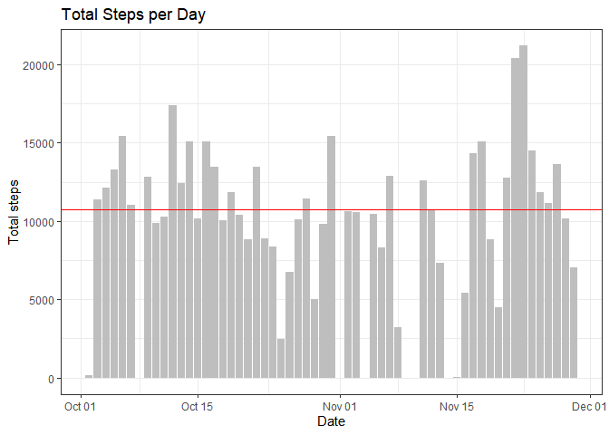
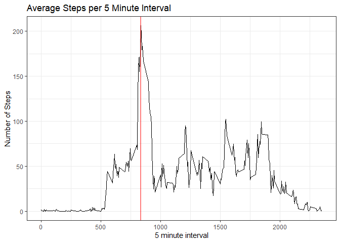
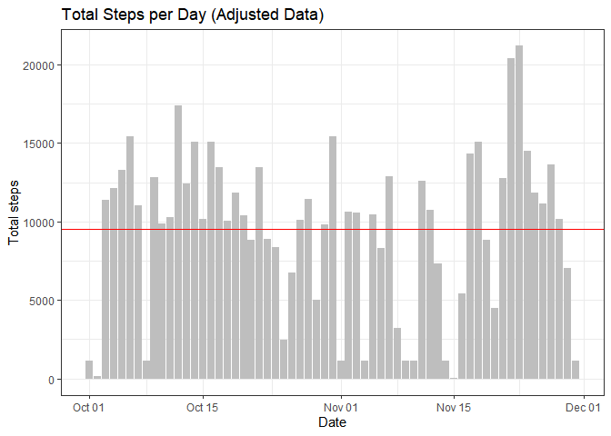
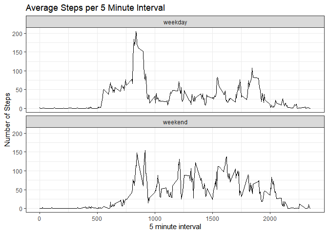

## Loading and preprocessing the data

This assignment makes use of data from a personal activity monitoring device. This device collects data at 5 minute intervals through out the day. The data consists of two months of data from an anonymous individual collected during the months of October and November, 2012 and include the number of steps taken in 5 minute intervals each day.

The variables included in this dataset are:

* steps: Number of steps taking in 5-minute interval. Missing values are coded as NA.  
* date: The date on which the measurement was taken in YYYY-MM-DD format.  
* interval: Identifier for 5-minute interval of measurement.  


```r
library(plyr); library(dplyr)
```

```
## 
## Attaching package: 'dplyr'
```

```
## The following objects are masked from 'package:plyr':
## 
##     arrange, count, desc, failwith, id, mutate, rename, summarise,
##     summarize
```

```
## The following objects are masked from 'package:stats':
## 
##     filter, lag
```

```
## The following objects are masked from 'package:base':
## 
##     intersect, setdiff, setequal, union
```

```r
myfile <- unzip('activity.zip')
df <- read.csv(myfile)
str(df)
```

```
## 'data.frame':	17568 obs. of  3 variables:
##  $ steps   : int  NA NA NA NA NA NA NA NA NA NA ...
##  $ date    : chr  "2012-10-01" "2012-10-01" "2012-10-01" "2012-10-01" ...
##  $ interval: int  0 5 10 15 20 25 30 35 40 45 ...
```

```r
num_int <- nrow(df)
num_na <- nrow(df[is.na(df$steps),])
df$date <- as.Date(df$date, tryFormats=c("%Y-%m-%d"))
df_totals <- df %>% group_by(date) %>% summarize(total=sum(steps))
```

There are 17568 rows representing 61 days x 288 5-minute intervals per day. Steps data is missing (NA) for 13.1% of the 17568 intervals. 


## What is mean total number of steps taken per day?


```r
library(ggplot2)
mean_steps <- mean(df_totals$total, na.rm=TRUE)
mean_steps_char <- format(mean_steps, digits=0, scientific=FALSE)
median_steps <- median(df_totals$total, na.rm=TRUE)
g <- ggplot(df_totals, aes(x=date, y=total)) + geom_col(fill='gray') +
        labs(title='Total Steps per Day',y='Total steps', x='Date') +
        geom_hline(yintercept=mean_steps, color='red') +
        theme_bw()
```

The following displays total steps per day. The mean number of steps per day is 10766. The median number of steps is 10765. The mean steps is shown as horizontal line below.


```
## Warning: Removed 8 rows containing missing values (position_stack).
```

<!-- -->


## What is the average daily activity pattern?


```r
daily <- df %>% group_by(interval) %>% summarize(mean=mean(steps, na.rm=TRUE))
# head(daily)
max_interval <- daily$interval[which.max(daily$mean)]
g <- ggplot(daily, aes(x=interval, y=mean))+geom_line() +
        labs(title='Average Steps per 5 Minute Interval',
             x='5 minute interval', y='Number of Steps') +
        geom_vline(xintercept=max_interval, col='red', size=1, alpha=0.5)+
        theme_bw()
```

The following displays average number of steps by 5 minute interval across all days. The interval with the highest average is 835.

<!-- -->


## Imputing missing values

There are 17568 rows representing 61 days x 288 5-minute intervals per day. Steps data is missing (NA) for 2304 of the intervals. This represents 13.1% of total intervals.


```r
# create new data frame replacing NA steps with imputed values. 
# If steps for an interval are NA, replace with median for that interval
df_imp <- ddply(df, ~ interval, transform, 
      steps = ifelse(is.na(steps),
      median(steps, na.rm=TRUE),
      steps))
```

Intervals with missing steps are replaced with median for that time interval across all dates.


```r
df_imp_totals <- df_imp %>% group_by(date) %>% summarize(total=sum(steps))
mean_imp_steps <- mean(df_imp_totals$total)
mean_imp_steps_char <- format(mean_imp_steps, digits=0, scientific=FALSE)
median_imp_steps <- median(df_imp_totals$total)
g <- ggplot(df_imp_totals, aes(x=date, y=total)) + geom_col(fill='gray') +
        labs(title='Total Steps per Day (Adjusted Data)',
             y='Total steps', x='Date') +
        geom_hline(yintercept=mean_imp_steps, color='red') +
        theme_bw()
```

The following displays total steps per day for the adjusted data. Replacing missing step data with imputed values reduces the mean and median total daily steps.

The mean steps per day is 9504.
This is -11.7% lower than mean
steps in original data of 10766.

The median steps per day is 10395. This is -3.4% lower than
median steps in original data of 10765.

<!-- -->


## Are there differences in activity patterns between weekdays and weekends?


```r
df_imp$weekday <- weekdays(df_imp$date)
df_imp <- mutate(df_imp, wkdy = ifelse(weekday %in% c('Saturday','Sunday'),'weekend', 'weekday'))
# head(df_imp,20)
daily <- df_imp %>% group_by(interval, wkdy) %>% summarize(mean=mean(steps))
```

```
## `summarise()` has grouped output by 'interval'. You can override using the
## `.groups` argument.
```

```r
# head(daily)

g <- ggplot(daily, aes(x=interval, y=mean))+geom_line() +
        labs(title='Average Steps per 5 Minute Interval',
             x='5 minute interval', y='Number of Steps') +
        theme_bw() +
        facet_wrap(~ wkdy, nrow=2)
```

The following displays average number of steps by 5 minute interval across all days. Weekdays are compared to weekends. There is some difference in activity pattern between weekdays and weekends.

<!-- -->
